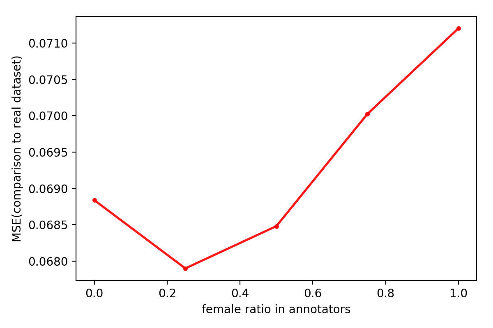
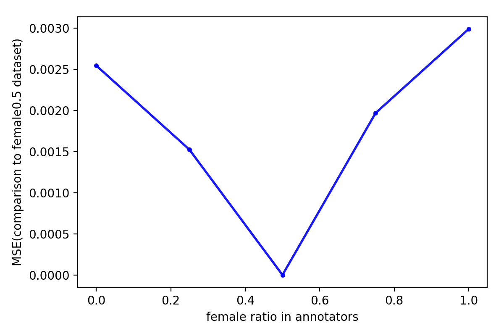
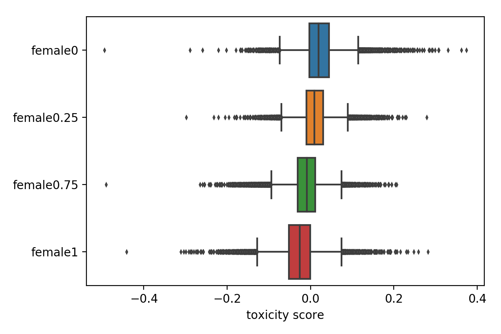

# How-Biases-in-Crowdworkers-Affect-the-Toxicity-Prediction

In this project, I was trying to identify potential effect of bias in the crowdworkers on the model predictions of toxicity scores.

## Abstract
Comment toxicity prediction has been a popular topic in the natural language processing field, since classification of comments is meaningful and can be used in various applications. The Wikipedia Talk corpus has provided an important source of comments which could be used to build machine learning models for toxicity prediction. However, previous analysis on demographics of annotators of the corpus has shown biases in toxicity scores given by annotators with different gender. In this project, I created several datasets with different ratio of female annotators and trained LSTM model on the dataset to predict toxicity scores. The analysis on prediction results showed that the biases introduced by biases in crowdworkers could affect the final output of machine learning models, thus influencing the accuracy and efficiency of related applications.

## Datasets and Documentations
The toxicity dataset from the [Wikipedia Talk corpus](https://figshare.com/projects/Wikipedia_Talk/16731) is analyzed in this project. The original data files are stored in the [raw-data](raw-data) folder. The dataset was first processed to create several files ready for the analysis (can be found in [data](data) folder). The results and generated images are stored in [results](results) folder and [images](images) folder respectively.

The entire analysis and working codes can be found in the [notebook](How-Biases-in-Crowdworkers-Affect-the-Toxicity-Prediction.ipynb). Addition script for model training is in [lstm-train.py](lstm-train.py).

## Directory Structure

```bash
├── data
│   ├── test.csv
│   ├── train_female0.5.csv
│   ├── train_female0.25.csv
│   ├── train_female0.75.csv
│   ├── train_female0.csv
│   └── train_female1.csv
├── images
│   ├── distribution.png
│   ├── mse_to_0.5.png
│   ├── mse_to_gt.png
│   └── toxicity_score_demo.png
├── raw-data
│   ├── toxicity_annotated_comments.tsv
│   ├── toxicity_annotations.tsv
│   └── toxicity_worker_demographics.tsv
├── results
│   ├── train_female0.5_predictions.csv
│   ├── train_female0.25_predictions.csv
│   ├── train_female0.75_predictions.csv
│   ├── train_female0_predictions.csv
│   └── train_female1_predictions.csv
├── .gitattributes
├── .gitignore
├── LICENSE
├── README.md
├── How-Biases-in-Crowdworkers-Affect-the-Toxicity-Prediction.ipynb
└── lstm-train.py
```

## Analysis Result

### MSEs calculated with predictions
Compared to real labels in the original dataset:


Compared to female0.5 dataset:


### Residual analysis
Boxplots shown distribution of predictions residuals:


## License
This project is under the [MIT License](LICENSE)
